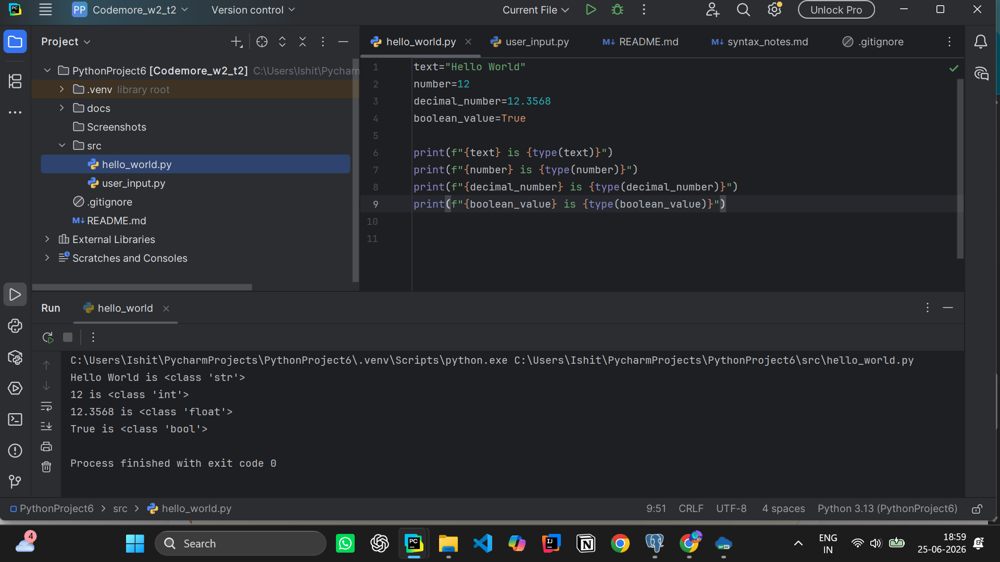
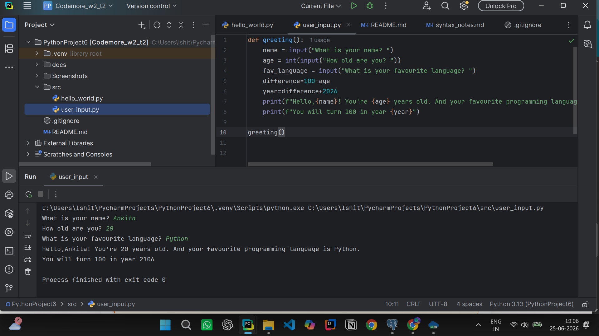

# CodeMore Week 2 - Task 2

## Overview

This project was created as part of an introductory Python programming task. The goal of this assignment was to learn the fundamentals of Python syntax, variables, data types, user input, and output formatting.

The project contains two Python scripts:

1. **hello_world.py** - Demonstrates different Python data types and prints their values and types.
2. **user_input.py** - Takes user input and generates a personalized greeting while calculating the year the user will turn 100.

---

## Project Structure

```text
README.md
src/
├── hello_world.py
└── user_input.py

docs/
└── syntax_notes.md

screenshots/
├── hello_world_output.png
└── user_input_output.png

.gitignore
```

---

## Requirements

- Python 3.x
- VS Code or PyCharm

---

## How to Run

### Run Hello World Script

```bash
python src/hello_world.py
```

### Run User Input Script

```bash
python src/user_input.py
```

---

## Concepts Learned

### Variables

Variables are used to store data in Python. Different variables can store different types of values.

### Data Types

- **String (str)**: Stores text values.
- **Integer (int)**: Stores whole numbers.
- **Float (float)**: Stores decimal numbers.
- **Boolean (bool)**: Stores either True or False.

### Input and Output

Python uses the `input()` function to accept user input and the `print()` function to display output on the console.

### Type Checking

The `type()` function is used to determine the data type of a variable.

---

## Screenshots

The screenshots folder contains screenshots showing successful execution of both scripts.

- hello_world.py output

- user_input.py output

---

## Conclusion

This assignment helped me understand Python syntax, variable declaration, data types, user interaction, and the importance of proper indentation in Python programs.